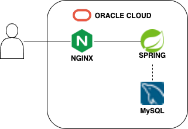

# 🫖 탕탕탕 - 탕비실 좌석 예약 서비스

패스트캠퍼스 이용 인원이 많아짐에 따라 **탕비실 좌석이 혼잡해지고**, 체계적으로 관리할 필요성이 생겼습니다.  
**탕탕탕**은 탕비실 좌석을 **효율적이고 공정하게 예약/관리**할 수 있는 서비스를 제공합니다.

---

## 👥 팀 소개

- **팀명:** 3팀 - 탕탕탕  
- **주제:** 탕비실 예약 서비스  

| 이름     | 역할 | 이메일 |
|----------|------|--------|
| 함성준   | 팀장 | emmitt9619@gmail.com |
| 정영현   | 팀원 | jeongyounghyeon1106@gmail.com |
| 윤여일   | 팀원 | dudlf016@gmail.com |
| 최대영   | 팀원 | maximum.zero95@gmail.com |

---

## 🧑‍💻 기술 스택

### Backend
- Java 17
- Spring Boot
- MyBatis
- MySQL

### Frontend
- HTML
- Javascript

---

## 📌 기능적 요구사항

- **회원가입 및 로그인**
  - 아이디 / 비밀번호 로그인

- **좌석 예약 기능**
  - 사용자는 탕비실의 좌석을 예약할 수 있습니다.

- **좌석 조회**
  - 특정 시간에 예약 가능한 모든 자리를 조회할 수 있습니다.
  - 특정 자리에 예약할 수 있는 시간을 조회할 수 있습니다.
  - 본인이 예약한 좌석을 조회할 수 있습니다.

---

## 🧩 DB 설계 (ERD)

## 아키텍처 다이어그램

